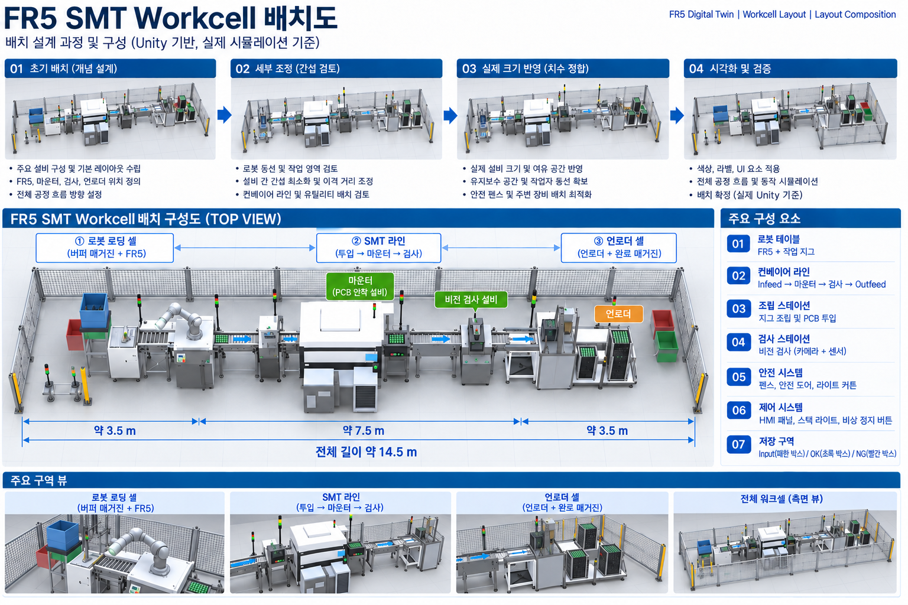

# 김성엽 | Robotics · Smart Factory · AI Vision Portfolio

> ROS2·Unity 기반 로봇 관제와 Digital Twin, AI Vision 품질검사, 산업용 UI부터 Python 기반 정보 관리 시스템까지 실제 문제를 구조화하고 데이터 흐름과 사용자 화면으로 구현한 프로젝트 포트폴리오입니다.

이 저장소는 프로젝트 소스와 상세 문서를 중복 보관하지 않습니다.
각 프로젝트의 **개인 담당 역할과 핵심 결과를 요약하고 실제 구현 GitHub로 바로 연결하는 통합 인덱스**입니다.

---

## Projects

| 프로젝트 | 유형 / 담당 | 핵심 내용 | 주요 기술 | 바로가기 |
|:---|:---|:---|:---|:---:|
| **AI 기반 조립식 주택 자동화 공장** | 팀 프로젝트 · **AI Vision / 품질검사** | 자재 수입검사와 PRE-ROOF 조립 결과 품질검사 | Python, YOLO, OpenCV, RealSense D435, ROS2 | [AI Perception](https://github.com/eduwing-robotics/ros2-ai-cobot-repo2/tree/main/ai_perception) |
| **TB3 Smart Factory Control Tower** | 팀 프로젝트 · **Unity 관제 UI** | TurtleBot3 상태·경로·영상·이벤트 통합 관제 | Unity, C#, ROS2, REST API, WebSocket | [ControlTower UI](https://github.com/eduwing-robotics/ros2-ai-amr-repo4/tree/main/controltower_ui) |
| **FR5 Digital Twin** | 개인 프로젝트 | ROS2·Gazebo·MoveIt2와 Unity 기반 FR5 SMT Digital Twin | ROS2, Gazebo, MoveIt2, Unity, C#, Python | [GitHub](https://github.com/seongyeop-dev/fr5-unity-digital-twin) |
| **PLT Monitor** | 개인 프로젝트 | 16개 대상 Transform 기록과 실시간 그래프 분석 | Unity, C#, uGUI, JSON, CSV | [GitHub](https://github.com/seongyeop-dev/plt_monitor) |
| **Industrial Kiosk System** | 개인 프로젝트 | 주문·상태·알람·로그·파일 저장 산업용 UI | Unity, C#, TXT, JSON, CSV, PNG | [GitHub](https://github.com/seongyeop-dev/industrial_kiosk_system) |
| **Quik Delivery** | 개인 프로젝트 | 배송·근무·통계·정산·백업 Android 앱 | Unity, C#, JSON, Android | [GitHub](https://github.com/seongyeop-dev/quik_delivery) |
| **Investment AI Radar** | 개인 프로젝트 | 공시·중요 정보·참고자료·일정을 통합한 투자정보 관리 | Python, FastAPI, Next.js, TypeScript, SQLite | [GitHub](https://github.com/seongyeop-dev/investment_ai_radar) |

---

# Team Projects

## 1. AI 기반 조립식 주택 자동화 공장

### AI Vision · 품질검사

조립식 주택 생산 공정에서 **자재 수입검사와 조립 결과 품질검사**를 담당한 팀 프로젝트입니다.

- **프로젝트 유형**: 교육과정 팀 프로젝트
- **담당 역할**: AI Vision · 품질검사
- **자재 수입검사**: 카메라 기반 부품 식별 및 투입 전 품질 확인
- **조립 품질검사**: PRE-ROOF 구조물을 TOP · LEFT · RIGHT · FRONT · BEHIND 5개 View로 검사
- **Vision 환경**: Global Camera와 Intel RealSense D435 기반 영상 처리
- **연동**: ROS2 · Server/FMS · Unity에 Vision 결과와 영상 데이터 전달
- **담당 소스 바로가기**: [팀 통합 저장소 / `ai_perception`](https://github.com/eduwing-robotics/ros2-ai-cobot-repo2/tree/main/ai_perception)

> 위 링크는 팀 저장소 전체가 아니라 제가 담당한 **AI Perception / Vision 구현 폴더**로 바로 연결됩니다.

---

## 2. TB3 Smart Factory Control Tower

  

TurtleBot3·ROS2·서버 데이터를 Unity 2D·3D 화면에 연결해 로봇 상태, 경로, 카메라 영상, 안전 이벤트와 제어 결과를 통합한 스마트팩토리 관제 시스템입니다.

- **프로젝트 유형**: 5인 팀 프로젝트
- **담당 역할**: Unity ControlTower UI 설계·구현, REST·WebSocket·Camera Stream 연동
- **핵심 구현**: 실제 수신값과 미수신 상태 구분, 로봇별 Pose·Route Cache, ROS–Unity 좌표 변환
- **결과**: Dashboard · Factory · Robot · Map · Camera View와 팀 서버·ROS2 명령 흐름 통합
- **담당 소스 바로가기**: [팀 통합 저장소 / `controltower_ui`](https://github.com/eduwing-robotics/ros2-ai-amr-repo4/tree/main/controltower_ui)

> 위 링크는 팀 저장소 전체가 아니라 제가 담당한 **Unity Control Tower UI 구현 폴더**로 바로 연결됩니다.

---

# Personal Projects

## 3. FR5 Digital Twin

  

실제 FAIRINO FR5 제어 경험을 기반으로 ROS2·Gazebo·MoveIt2 시뮬레이션과 Unity Digital Twin을 연결하고, Jig 공급부터 SMT 공정과 Finish Magazine까지 하나의 Workcell로 구성한 개인 프로젝트입니다.

- **핵심 구현**: ROS2 JointState 기반 Unity 관절 동기화
- **Motion**: Magazine Slot Jig Pick · Extract · Carry · Insert · Release
- **Simulation**: Gazebo Sim 8, MoveIt2 Planning Scene, Collision 검증
- **Process**: Jig Supply → Conveyor → Mounter → Inspection → Conveyor → Unloader → Finish Magazine
- **검증**: Python/NumPy MDH FK와 Unity C# FK 기반 Position · Rotation 비교
- **UI / Camera**: 공정 상태 UI, Camera Director / Follow, FHD Recording
- **저장소**: [fr5-unity-digital-twin](https://github.com/seongyeop-dev/fr5-unity-digital-twin)

---

## 4. PLT Monitor

  

Unity 생산 라인의 16개 대상에서 Transform 데이터를 기록하고 Overview·Detail·Focus 그래프로 분석하는 실시간 모니터링 프로젝트입니다.

- **핵심 구현**: 대상별 롤링 버퍼, 다중·단일 그래프, Live View, JSON·CSV 저장
- **문제 해결**: 데이터 기록과 UI redraw 주기 분리, Sliding Window 적용
- **결과**: 기능 QA와 Windows Standalone 빌드 완료
- **저장소**: [plt_monitor](https://github.com/seongyeop-dev/plt_monitor)

---

## 5. Industrial Kiosk System

  

주문·상태·알람·로그와 로컬 파일 저장을 하나의 Unity 화면에 통합한 산업용 키오스크 프로젝트입니다.

- **핵심 구현**: 주문 CRUD, 입력 검증, 상태·알람 관리, 영수증 PNG, JSON·CSV 로그
- **안정화**: 표시·메모리·저장 로그 수 제한, 앱 재실행 데이터 복원
- **결과**: Windows Intel 64-bit 빌드와 주요 기능 검증 완료
- **저장소**: [industrial_kiosk_system](https://github.com/seongyeop-dev/industrial_kiosk_system)

---

## 6. Quik Delivery

  

실제 배송 업무의 배송·근무 기록, 수익·비용 통계, 달력, 월별 정산과 백업을 통합한 Unity 기반 Android 애플리케이션입니다.

- **핵심 구현**: 배송·근무 기록, 기간별 통계, 월별 정산, JSON 백업·복원
- **문제 해결**: 배송 0건 날짜의 고정비를 기존 데이터 변경 없이 누락 날짜에만 보정
- **결과**: Android 실행과 공개 저장소 정리 완료
- **저장소**: [quik_delivery](https://github.com/seongyeop-dev/quik_delivery)

---

## 7. Investment AI Radar

공식 공시, 중요 정보, 공개 참고자료와 경제·기업 일정을 한곳에서 수집·검토하고, 출처와 근거를 기준으로 종목별 관리 방향과 변경 기반 브리핑을 정리하는 개인 투자정보 관리 프로젝트입니다.

- **핵심 구현**: 공식 출처·참고자료 등록, 중요 정보·공시·일정 확인, 통합 사건 연결, 변경 기반 브리핑
- **관리 기준**: 사용자 위험 기준과 종목별 관리 방향을 규칙 기반으로 정리하고 부족한 데이터는 추정하지 않고 그대로 표시
- **안전 범위**: 자동 주문·자동매매·증권계좌 연동 없이 최종 투자 판단과 실제 주문은 사용자에게 유지
- **품질 확인**: Backend · UI · Next.js Route · Playwright E2E 검증
- **저장소**: [investment_ai_radar](https://github.com/seongyeop-dev/investment_ai_radar)

---

## Core Skills

| 분류 | 기술 |
|:---|:---|
| Robotics | ROS2, Gazebo, MoveIt2, Nav2, TurtleBot3, FAIRINO FR5 |
| AI · Vision | Python, YOLO, OpenCV, Intel RealSense D435, Synthetic Data |
| Engine · UI | Unity, C#, uGUI, TextMeshPro |
| Backend · Web | Python, FastAPI, Next.js, React, TypeScript, SQLAlchemy |
| Communication | REST API, WebSocket, ROS–TCP, UDP, Camera Stream |
| Data | JSON, CSV, TXT, SQLite, `Application.persistentDataPath` |
| Visualization | Digital Twin, 2D·3D 관제 UI, 실시간 그래프, 상태·경로 시각화 |
| Collaboration | Git, GitHub, Jira, Confluence, Slack |

---

## Repository Policy

- 이 저장소는 완료 프로젝트를 연결하는 통합 포트폴리오 인덱스입니다.
- 상세 기능, 아키텍처, 데이터 흐름과 검증 결과는 각 프로젝트 저장소에서 관리합니다.
- 팀 프로젝트는 **팀 전체 저장소가 아니라 개인 담당 구현 폴더로 직접 연결**합니다.
- 개인 프로젝트는 해당 개인 GitHub 저장소의 `main`으로 연결합니다.
- 프로젝트가 완료될 때마다 대표 이미지와 프로젝트 링크를 갱신합니다.
- 진행 중인 기능을 완료된 성과로 표시하지 않습니다.
- 팀 기능과 개인 담당 범위를 명확하게 구분합니다.
