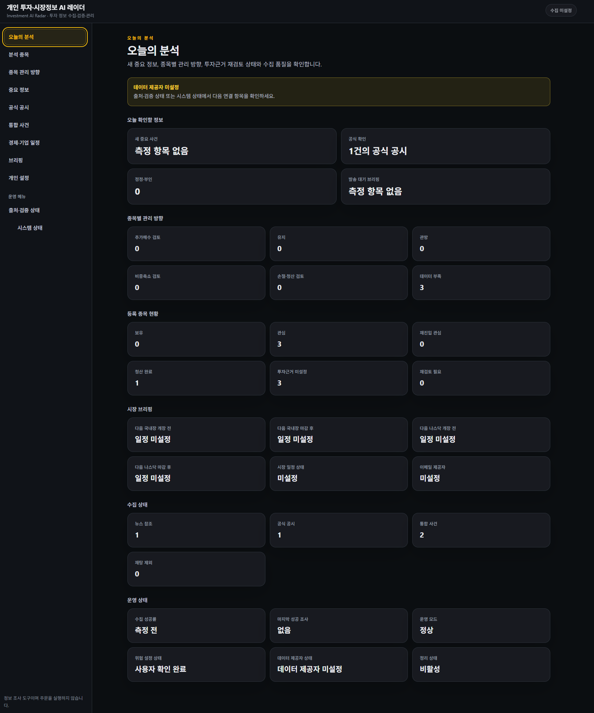
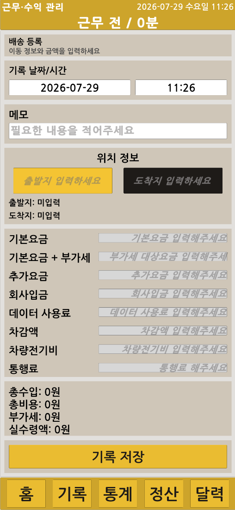

# 김성엽 | Robotics · Smart Factory Portfolio

> Unity·C# 기반 로봇 관제와 산업용 UI부터 Python·FastAPI·Next.js 기반 정보 수집·검토 애플리케이션까지, 실제 문제를 구조화하고 데이터 흐름과 사용자 화면으로 구현한 프로젝트 포트폴리오입니다.
이 저장소는 프로젝트 소스와 상세 문서를 중복 보관하지 않습니다. 각 프로젝트의 핵심 역할과 결과를 요약하고, 독립 GitHub 저장소로 연결하는 통합 인덱스입니다.

## 프로젝트 목록

| 프로젝트 | 핵심 내용 | 주요 기술 | 저장소 |
|:---|:---|:---|:---:|
| **TB3 Smart Factory Control Tower** | TurtleBot3 상태·경로·영상·이벤트 통합 관제 | Unity, C#, ROS2, REST API, WebSocket | [GitHub](https://github.com/seongyeop-dev/tb3_smart_factory_control_tower) |
| **Industrial Kiosk System** | 주문·상태·알람·로그와 파일 저장을 통합한 산업용 UI | Unity, C#, TXT, JSON, CSV, PNG | [GitHub](https://github.com/seongyeop-dev/industrial_kiosk_system) |
| **PLT Monitor** | 16개 대상의 Transform 기록과 실시간 그래프 분석 | Unity, C#, uGUI, JSON, CSV | [GitHub](https://github.com/seongyeop-dev/plt_monitor) |
| **Quik Delivery** | 배송·근무·통계·정산·백업을 통합한 Android 앱 | Unity, C#, JSON, Android | [GitHub](https://github.com/seongyeop-dev/quik_delivery) |
| **FR5 Cocktail Robot Demo** | 실제 FR5 Pick & Place와 메뉴별 제조 순서 중간 시연 | FR5, Lua, PTP, LIN, Spiral | [GitHub](https://github.com/seongyeop-dev/fr5_cocktail_robot_demo) |
| **Investment AI Radar**            | 공시·중요 정보·참고자료·일정을 통합해 종목별 관리 근거와 변경 기반 브리핑 정리 | Python, FastAPI, Next.js, TypeScript, SQLite |          [GitHub](https://github.com/seongyeop-dev/INVESTMENT_AI_RADAR)          |
## 대표 프로젝트

### TB3 Smart Factory Control Tower

  

TurtleBot3·ROS2·서버 데이터를 Unity 2D·3D 화면에 연결해 로봇 상태, 경로, 카메라 영상, 안전 이벤트와 제어 결과를 통합한 스마트팩토리 관제 시스템입니다.

- **프로젝트 유형**: 5인 팀 프로젝트
- **담당 역할**: Unity ControlTower UI 설계·구현, REST·WebSocket·Camera Stream 연동
- **핵심 구현**: 실제 수신값과 미수신 상태 구분, 로봇별 Pose·Route Cache, ROS–Unity 좌표 변환
- **결과**: Dashboard·Factory·Robot·Map·Camera View와 팀 서버·ROS2 명령 흐름 통합
- **링크**: [개인 포트폴리오 저장소](https://github.com/seongyeop-dev/tb3_smart_factory_control_tower) · [팀 ControlTower UI](https://github.com/eduwing-robotics/ros2-ai-amr-repo4/tree/main/controltower_ui)

## 추가 프로젝트
### Investment AI Radar

공식 공시, 중요 정보, 공개 참고자료와 경제·기업 일정을 한곳에서 수집·검토하고, 출처와 근거를 기준으로 종목별 관리 방향과 변경 기반 브리핑을 정리하는 개인 투자정보 관리 프로젝트입니다.

- **핵심 구현**: 공식 출처·참고자료 등록, 중요 정보·공시·일정 확인, 통합 사건 연결, 변경 기반 브리핑
- **관리 기준**: 사용자 위험 기준과 종목별 관리 방향을 규칙 기반으로 정리하고 부족한 데이터는 추정하지 않고 그대로 표시
- **안전 범위**: 자동 주문·자동매매·증권계좌 연동 없이 최종 투자 판단과 실제 주문은 사용자에게 유지
- **품질 확인**: Backend 625/625, UI 43/43, Next.js 18/18 routes, Playwright E2E 11/11 PASS
- **저장소**: [INVESTMENT_AI_RADAR](https://github.com/seongyeop-dev/INVESTMENT_AI_RADAR)
### Industrial Kiosk System

  

주문·상태·알람·로그와 로컬 파일 저장을 하나의 Unity 화면에 통합한 산업용 키오스크 프로젝트입니다.

- **핵심 구현**: 주문 CRUD, 입력 검증, 상태·알람 관리, 영수증 PNG, JSON·CSV 로그
- **안정화**: 표시·메모리·저장 로그 수 제한, 앱 재실행 데이터 복원
- **결과**: Windows Intel 64-bit 빌드와 주요 기능 검증 완료
- **저장소**: [industrial_kiosk_system](https://github.com/seongyeop-dev/industrial_kiosk_system)

### PLT Monitor

  

Unity 생산 라인의 16개 대상에서 Transform 데이터를 기록하고 Overview·Detail·Focus 그래프로 분석하는 실시간 모니터링 프로젝트입니다.

- **핵심 구현**: 대상별 롤링 버퍼, 다중·단일 그래프, Live View, JSON·CSV 저장
- **문제 해결**: 데이터 기록과 UI redraw 주기 분리, Sliding Window 적용
- **결과**: 기능 QA와 Windows Standalone 빌드 완료
- **저장소**: [plt_monitor](https://github.com/seongyeop-dev/plt_monitor)

### Quik Delivery

  

실제 배송 업무의 배송·근무 기록, 수익·비용 통계, 달력, 월별 정산과 백업을 통합한 Unity 기반 Android 애플리케이션입니다.

- **핵심 구현**: 배송·근무 기록, 기간별 통계, 월별 정산, JSON 백업·복원
- **문제 해결**: 배송 0건 날짜의 고정비를 기존 데이터 변경 없이 누락 날짜에만 보정
- **결과**: Android 실행과 공개 저장소 정리 완료
- **저장소**: [quik_delivery](https://github.com/seongyeop-dev/quik_delivery)

### FR5 Cocktail Robot Demo

  <a href="https://github.com/seongyeop-dev/fr5_cocktail_robot_demo">
    

  

  </a>

FR5 Unity Digital Twin 개발 과정에서 실제 FR5 로봇의 Pick & Place와 메뉴별 칵테일 제조 순서를 검증한 완료된 중간 시연 데모입니다.

- **개인 담당**: Pick & Place 포인트·Lua 시퀀스 작성과 실제 장비 테스트
- **팀 통합 결과**: DI 입력 메뉴 분기, PTP·LIN·MoveGripper·Spiral 기반 제조 순서
- **결과**: 메뉴 1·메뉴 2·Pick & Place 실제 시연 완료
- **저장소**: [fr5_cocktail_robot_demo](https://github.com/seongyeop-dev/fr5_cocktail_robot_demo)

## 핵심 기술

| 분류 | 기술 |
|:---|:---|
| Engine · UI | Unity, C#, uGUI, TextMeshPro |
| Backend · Web | Python, FastAPI, Next.js, React, TypeScript, SQLAlchemy    |
| Robotics | ROS2, Nav2, TurtleBot3, FR5 |
| Communication | REST API, WebSocket, JPEG Camera Stream, ROS–TCP |
| Data | JSON, CSV, TXT, SQLite, `Application.persistentDataPath` |
| Visualization | 2D·3D 관제 UI, 실시간 그래프, 상태·경로 시각화 |
| Collaboration | Git, GitHub, Jira, Confluence, Slack |

## 저장소 운영 원칙

- 이 저장소는 완료 프로젝트를 연결하는 통합 인덱스입니다.
- 상세 기능, 아키텍처, 데이터 흐름과 검증 결과는 각 프로젝트 저장소에서 관리합니다.
- 프로젝트가 완료될 때마다 대표 이미지 1장과 프로젝트 링크를 추가합니다.
- 진행 중인 기능을 완료된 성과로 표시하지 않습니다.
- 팀 기능과 개인 담당 범위를 구분합니다.
