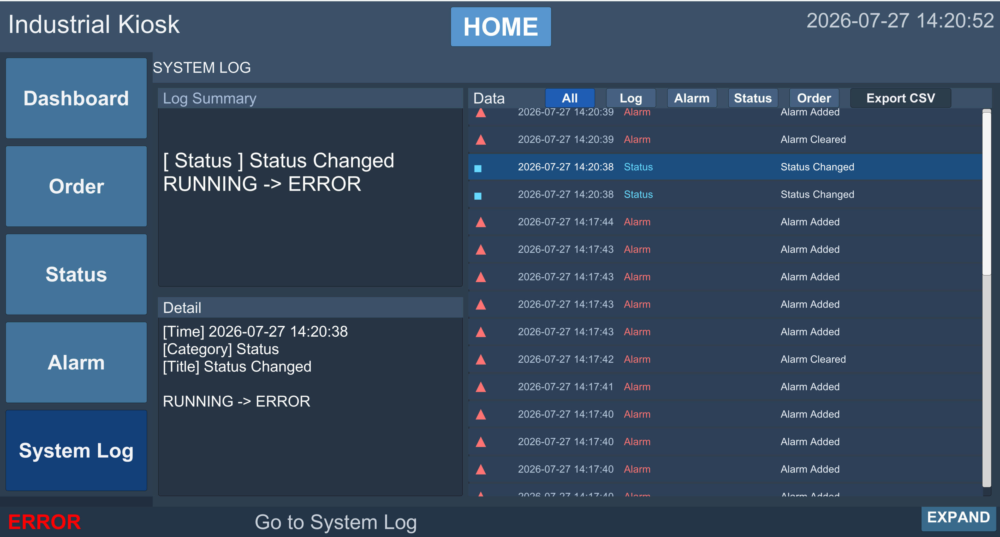

# Industrial Kiosk System

Unity와 C#으로 주문·상태·알람·로그 및 파일 저장을 통합한 산업용 키오스크 시스템입니다.

<p align="center">
  
</p>

## 개발 배경과 목표

산업 현장에서 주문과 시스템 상태, 알람, 로그를 한 화면에서 확인하고 실행 위치와 무관하게 데이터를 저장·복원할 수 있는 경량 UI를 구현하는 것이 목표입니다.

## 기본 정보

| 항목 | 내용 |
|---|---|
| 개발 기간 | 확인 필요 |
| 프로젝트 유형 | 확인 필요 |
| 담당 역할 | 확인 필요 — 저장소 문서에 전체 구현 범위는 정리되어 있으나 개인·팀 구분이 명시되지 않음 |
| 저장소 | [kimseongyeop2811-ux/Kiosk](https://github.com/kimseongyeop2811-ux/Kiosk) |
| 최종 상태 | Windows Intel 64-bit 빌드 성공 |

## 기술 스택

- **Engine / UI**: Unity, C#
- **Data**: TXT, JSON, CSV
- **Output**: PNG
- **Version Control**: Git, GitHub

## 주요 기능

- Page Router 기반 Home / Detail 전환
- 주문 추가·수정·삭제와 주문 상태 관리
- 주문번호 자동 생성·중복 방지
- 제품명·수량·날짜 입력 검증
- `orders.txt` 저장과 앱 시작 시 복원
- 개별 주문서 TXT와 영수증 PNG 출력
- READY / RUNNING / ERROR 상태 변경
- 알람 생성·목록·상세 조회·전체 삭제
- 주문·상태·알람 로그 JSON 저장과 CSV Export

## 시스템 구조

```text
Page Router / Page Controllers
              ↓
Order / Dashboard / Status / Alarm Controllers
              ↓
OrderData / LogData / TXT / JSON / CSV / PNG
              ↓
Application.persistentDataPath/KioskData
```

UI 화면 전환, 업무 데이터 처리, 파일 저장과 반복 Row 표시를 나누어 구성했습니다.

## 핵심 구현

### 파일 기반 데이터 영속성

`Application.persistentDataPath` 아래에 주문, 주문서, 영수증과 로그를 분리 저장합니다. 앱 시작 시 `orders.txt`를 불러와 주문 목록을 복원합니다.

### 반복 UI와 입력 검증

주문·알람·로그 Row는 Prefab 기반으로 생성합니다. 주문번호 중복과 제품명·수량·날짜 입력을 저장 전에 검증합니다.

### 출력 형식 분리

- 전체 주문: TXT
- 개별 주문서: TXT
- 영수증: PNG
- 시스템 로그: JSON
- 로그 내보내기: CSV

## 문제와 해결 과정

| 문제 | 해결 | 결과 |
|---|---|---|
| 페이지 이동과 단순 클릭까지 기록되어 로그 증가 | 실제 주문·상태·알람 변경만 기록 | 의미 있는 이력 중심으로 정리 |
| 로그가 화면·메모리·파일에 계속 누적될 가능성 | 표시·메모리·저장 개수 제한 | 장시간 사용 시 누적 부담 완화 |
| 매 프레임 시간 UI 갱신 | `TimeDisplay`를 1초 주기로 변경 | 불필요한 UI 갱신 감소 |
| 영수증 캡처 Texture 누적 가능성 | PNG 저장 후 임시 Texture 해제 | 반복 출력 시 메모리 누적 방지 |

## 성능 및 안정화

- 새 로그 1건만 UI 상단에 추가
- 화면 및 저장 로그 수 제한
- 반복 Row UI Prefab화
- 쓰기 가능한 운영체제 사용자 경로 사용
- 저장, 앱 재실행 복원과 Windows 빌드 검증

## 테스트 결과

주문 CRUD, 자동 주문번호·중복 방지, 주문·주문서 TXT, 영수증 PNG, 상태, 알람, 로그 필터·JSON·CSV, 재실행 복원과 Windows Intel 64-bit 빌드가 저장소 테스트 문서에서 PASS로 기록되어 있습니다.

## 대표 화면

### 주문 관리

<p align="center">
  
</p>

### 시스템 로그

<p align="center">
  
</p>

## 면접 설명

이 프로젝트에서는 산업용 키오스크의 주문·상태·알람·로그 흐름을 Unity로 구성하고, UI와 데이터·파일 저장 책임을 분리했습니다. `Application.persistentDataPath`에 TXT·JSON·CSV·PNG를 목적별로 저장했으며, 의미 없는 로그를 제거하고 표시·메모리·저장 수와 갱신 주기를 제한했습니다. 마지막으로 앱 재실행 복원과 Windows Intel 64-bit 빌드까지 확인했습니다.

## 추가 확인이 필요한 내용

- 개발 기간
- 개인 / 팀 프로젝트 구분
- 개인 담당 역할과 기여도

## 원본 문서

- [프로젝트 GitHub](https://github.com/kimseongyeop2811-ux/Kiosk)
- [통합 포트폴리오 홈](../../README.md)
