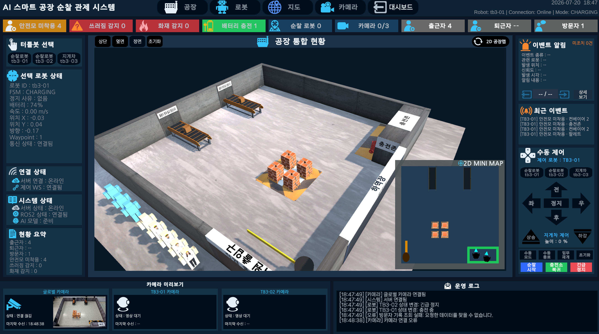

# TB3 Smart Factory Control Tower

TurtleBot3·ROS2·서버 데이터를 Unity 2D·3D 화면에 연결해 상태, 경로, 영상, 안전 이벤트와 제어 결과를 통합한 스마트 공장 관제 시스템입니다.

<p align="center">
  
</p>

## 개발 배경과 목표

로봇·카메라·AI·서버 정보가 분리되어 운영자가 현재 상태와 위험 상황을 한눈에 보기 어려운 문제를 해결하고, 감지부터 확인·제어·기록까지 이어지는 관제 흐름을 제공하는 것이 목표입니다.

## 기본 정보

| 항목 | 내용 |
|---|---|
| 개발 기간 | 확인 필요 |
| 프로젝트 유형 | 5인 팀 프로젝트 |
| 담당 역할 | Unity ControlTower UI와 데이터 연동·시각화·Runtime 안정화 |
| 개인 저장소 | [tb3-smart-factory-control-tower](https://github.com/kimseongyeop2811-ux/tb3-smart-factory-control-tower) |
| 팀 저장소 | [eduwing-robotics/ros2-ai-amr-repo4](https://github.com/eduwing-robotics/ros2-ai-amr-repo4) |

AI 추론, FastAPI·DB, ROS2·Nav2 알고리즘과 하드웨어 제작은 다른 팀 파트의 구현입니다. 담당 범위는 해당 결과를 Unity에서 수신·표시하고 운영자 명령을 전달하는 영역입니다.

## 기술 스택

- **Engine / UI**: Unity, C#
- **Data / Communication**: REST API, WebSocket, JPEG Camera Stream
- **Robotics Integration**: ROS2, Nav2, TurtleBot3
- **Collaboration**: GitHub, Jira, Confluence, Slack

## 주요 기능

- Dashboard / Factory / Robot / Map / Camera·AI View
- 3대 TurtleBot3 상태·위치·속도·배터리 표시
- Route·Waypoint·Nav2 진행 상태 시각화
- Global CCTV와 TB3 카메라 스트림
- AI 안전 이벤트 Popup·Snapshot·최근 이벤트
- 수동 주행·긴급정지·충전소 복귀 요청 UI
- TB3-03 리프트 명령과 승인 상태 기반 시각화

## 시스템 구조

```text
TurtleBot3 / Camera / AI
          ↓
ROS2 / Nav2 / FastAPI / DB
          ↓ REST / WebSocket / JPEG Stream
Unity ControlTower
          ↓
Dashboard / Factory / Robot / Map / Camera·AI
```

Unity는 로봇을 직접 제어하지 않고 FastAPI·ROS2 명령 계층에 요청합니다. 요청 성공과 실제 장치 실행 결과는 ACK와 후속 상태로 구분합니다.

## 핵심 구현

### 실제 데이터와 미수신 상태 구분

필드 존재 여부, nullable 상태와 수신 시각을 함께 관리해 미수신 값을 실제 숫자 `0`으로 표시하지 않습니다. 최종 Runtime 화면은 Mock 숫자로 정상 상태를 채우지 않고 서버 수신값을 표시합니다.

### 런타임 캐시

로봇별 마지막 정상 Pose와 Route를 보관해 화면 재진입과 부분 패킷 사이에도 유효 상태를 유지합니다. 이벤트 Snapshot은 이벤트 식별자별로 분리합니다.

### 관제형 디지털 트윈

ROS Pose를 공통 원점·축·스케일 기준으로 Unity 좌표에 변환하고 로봇, Route, 이벤트 Marker와 공장 구역명에 동일하게 적용합니다.

## 문제와 해결 과정

| 문제 | 해결 | 결과 |
|---|---|---|
| View 재진입 시 로봇 위치 초기화 | 마지막 정상 Pose Cache | 화면 활성화 직후 최신 위치 표시 |
| 부분 상태 패킷이 Route를 삭제 | 필드 유효성 검사와 갱신 경로 분리 | 기존 정상 Route 유지 |
| WebSocket 연결 중 영상 정지 | 마지막 실제 JPEG 적용 시각 추적 | 연결과 실제 영상 상태 구분 |
| 비동기 Snapshot 덮어쓰기 | 이벤트별 Snapshot Cache | Popup과 상세 화면 일관성 유지 |
| ROS 좌표와 Unity 공간 불일치 | 공통 좌표 변환·구역 판정 | 2D·3D 위치와 구역명 통일 |

## 성능 및 안정화

- 화면 전환 뒤 선택 로봇과 최신 상태 유지
- 부분 데이터로 정상 값을 무조건 삭제하지 않음
- 카메라별 Texture와 프레임 상태 분리
- 요청 성공과 명령 승인·실행 상태 구분
- 공개 이미지에서 얼굴·내부 서버 주소 제외

## 테스트 및 검증 범위

팀 발표 자료의 요구사항·시나리오와 Unity 관련 상태·경로·영상·이벤트·제어 표시 항목이 문서화되어 있습니다. 다만 45개 체크 항목을 개인 완료 수치로 사용하지 않으며, 공개 통합 시연 링크와 일부 실제 장비 종단 검증은 보류 상태입니다.

리프트는 실제 높이 센서 기반 물리 복제가 아니라 서버 승인 명령 기반 시각화입니다. 팔레트 픽업·추종·투하 로직도 공개된 실제 장비 종단 검증과 구분합니다.

## 대표 화면

### 3D Factory View

<p align="center">
  
</p>

### Map Status View

<p align="center">
  
</p>

## 면접 설명

5인 팀의 AI·서버·ROS2·하드웨어 결과를 운영자가 사용할 수 있도록 Unity ControlTower UI와 데이터 연동을 담당했습니다. 부분 패킷과 화면 재진입에서 상태가 사라지는 문제는 로봇별 유효 상태 캐시로 해결했고, WebSocket 연결 여부가 아니라 실제 JPEG 프레임 수신 시각으로 영상 상태를 판정했습니다. 팀 기능과 개인 구현 범위, 실제 데이터와 명령 기반 시각화의 한계를 명확히 구분했습니다.

## 추가 확인이 필요한 내용

- 개발 기간과 정량 기여도
- 개인정보를 제거한 전체 통합 시연 링크
- TB3-03 리프트·팔레트 실제 장비 종단 검증 자료
- 공개 가능한 이벤트 Popup 이미지

## 원본 문서

- [개인 포트폴리오 저장소](https://github.com/kimseongyeop2811-ux/tb3-smart-factory-control-tower)
- [팀 통합 저장소](https://github.com/eduwing-robotics/ros2-ai-amr-repo4)
- [팀 저장소의 ControlTower UI](https://github.com/eduwing-robotics/ros2-ai-amr-repo4/tree/main/controltower_ui)
- [통합 포트폴리오 홈](../../README.md)
